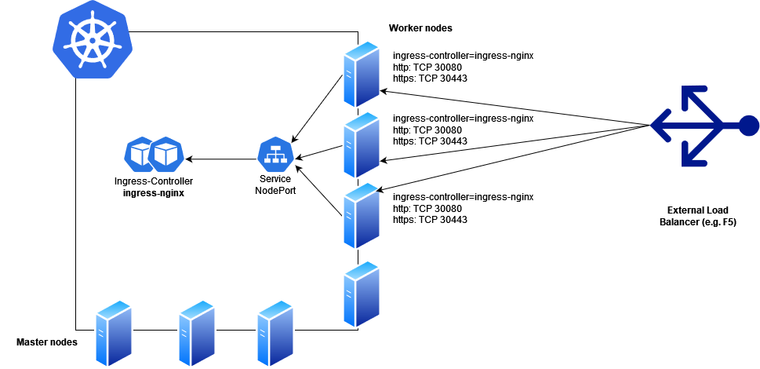

# Ingress-Nginx

This solutions shows how to install ingress-nginx, an open source ingress-controller on OpenShift cluster

[https://github.com/kubernetes/ingress-nginx](https://github.com/kubernetes/ingress-nginx)

## Prerequisites

Installation was tested with versions:
- ingress-nginx v1.10.0
- helm chart 4.10.0
- helm cli >= 3.0
- OpenShift 3 or 4

Cluster requirements
- Min 3x worker nodes for ingress-nginx controller copies.
- Worker nodes labeled with ingress-controller=ingress-nginx.
- External load balancer with direct access to worker nodes IPs and ports in range 30000-32767.

Diagram:



The following images should be transferred to locally available registry if cluster nodes have not direct access to internet:
- registry.k8s.io/ingress-nginx/controller:v1.10.0
- registry.k8s.io/ingress-nginx/kube-webhook-certgen:v1.4.1

The instruction of how to transfer images to local repository is available at: [Copy images from public registries to local one](../podman/podman-copy-images.md)

## Installation

The mentioned installation process was performed on the Linux host with direct access to the internet.

1. Download the chart:

```bash
wget https://github.com/kubernetes/ingress-nginx/releases/download/helm-chart-4.10.0/ingress-nginx-4.10.0.tgz
tar zxf ingress-nginx-4.10.0.tgz
cd ingress-nginx
```

2. Modify the template files:

```bash
rm templates/admission-webhooks/job-patch/role.yaml
vi templates/admission-webhooks/job-patch/role.yaml

{{- if and .Values.controller.admissionWebhooks.enabled .Values.controller.admissionWebhooks.patch.enabled (not .Values.controller.admissionWebhooks.certManager.enabled) -}}
apiVersion: rbac.authorization.k8s.io/v1
kind: Role
metadata:
  name: {{ include "ingress-nginx.admissionWebhooks.fullname" . }}
  namespace: {{ include "ingress-nginx.namespace" . }}
  annotations:
    "helm.sh/hook": pre-install,pre-upgrade,post-install,post-upgrade
    "helm.sh/hook-delete-policy": before-hook-creation,hook-succeeded
  labels:
    {{- include "ingress-nginx.labels" . | nindent 4 }}
    app.kubernetes.io/component: admission-webhook
    {{- with .Values.controller.admissionWebhooks.patch.labels }}
    {{- toYaml . | nindent 4 }}
    {{- end }}
rules:
  - apiGroups:
      - ""
    resources:
      - secrets
    verbs:
      - get
      - create
  - apiGroups: ["security.openshift.io"]
	resources: ["securitycontextconstraints"]
	resourceNames: ["privileged"]
	verbs: ["use"]
{{- end }}

#save 
```

3. Prepare the custom values.yaml for the installation:

```bash
vim values-custom.yaml

controller:
  image:
    registry: <local_registry_url>
    image: ingress-nginx/controller
    tag: "v1.10.0"
    digest: <sha256>
  kind: DaemonSet
  nodeSelector:
    ingress-controller: ingress-nginx
  service:
    type: NodePort
    externalTrafficPolicy: "Local"
    nodePorts:
      http: "30080"
      https: "30443"
  admissionWebhooks:
    patch:
      image:
        registry: <local_registry_url>
        image: ingress-nginx/kube-webhook-certgen
        tag: v1.4.1
        digest: <sha256>
      nodeSelector:
        kubernetes.io/os: linux
        ingress-controller=ingress-nginx
```

4. Label nodes where ingress-nginx PODs will be scheduled:

```bash
kubectl label node <nodeName> ingress-controller=ingress-nginx
# repeat on every node
```

5. Install ingress-nginx in its own namespace:

```bash
# check if templates are correctly rendered
helm template -n ingress-nginx ingress-nginx . -f values-custom.yaml

# install
helm install -n ingress-nginx ingress-nginx . -f values-custom.yaml
```

## Validation

1. Check if PODs are correctly running in the ingress-nginx namespace:

```bash
kubectl get pod -n ingress-nginx
```

2. Deploy test application:

```bash
apiVersion: v1
kind: Namespace
metadata:
  name: httpbin
---
apiVersion: v1
kind: Service
metadata:
  name: httpbin
  namespace: httpbin
spec:
  ports:
  - name: http
    port: 8080
    protocol: TCP
    targetPort: 80
  selector:
    app: httpbin
  type: ClusterIP
---
apiVersion: apps/v1
kind: Deployment
metadata:
  name: httpbin
  namespace: httpbin
spec:
  selector:
    matchLabels:
      app: httpbin
  template:
    metadata:
      labels:
        app: httpbin
    spec:
      containers:
        image: ennethreitz/httpbin
		tag: latest
        name: httpbin

apiVersion: networking.k8s.io/v1
kind: Ingress
metadata:
  name: httpbin
  namespace: httpbin
spec:
  ingressClassName: nginx
  rules:
    - host: httpbin.com
      http:
        paths:
          - pathType: Prefix
            backend:
              service:
                name: httpbin
                port:
                  number: 8080
            path: /
```

3. Run the test call towards External Load Balancer IP with custom Host header to allow ingress-controller route the request to your application:

```bash
curl -H "Host: httpbin.com" http://<LoadBalancerIP>/get
```